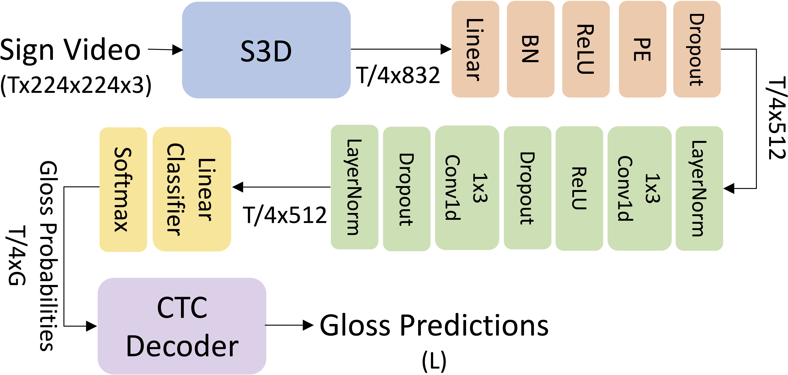

# Handshape-Aware Sign Language Recognition
A sign language recognition system that incorporates handshape information, which is an implementation of:

[**Handshape-Aware Sign Language Recognition: Extended Datasets and Exploration of Handshape-Inclusive Method, Zhang and Duh, EMNLP-Findings 2023**](https://www.cs.jhu.edu/~xzhan138/papers/handshape.pdf)

This implementation is based on [TwoStreamSLT](https://github.com/ChenYutongTHU/TwoStreamSLT.git). Please consider also citing their work:

[**Two-Stream Network for Sign Language Recognition and Translation, Chen et al., NeurIPS2022**](https://arxiv.org/abs/2211.01367)


## Introduction
### Sign Language Recognition (SLR)
SLR is the task of recognizing and translating signs into glosses, the written representations of signs typically denoted by spoken language words. In this study, we focus on the continuous SLR (CSLR), which refers to the recognition of sign language at the sentence level, as opposed to Isolated SLR, which operates at the word level. In recent developments of CSLR, a predominant methodology has emerged that employs a hybrid model. The model is usually composed of three essential components: a visual encoder, which extracts the spatial features from each frame of the sign video; a sequence encoder, responsible for learning the temporal information; and an alignment module which monotonically aligns frames to glosses.


One example of the architecure of a SLR system is shown below. The head network is composed of <span style="color:rgb(251,195,166)">orange</span> and <span style="color:rgb(186,219,174)">green</span> blocks. $T$ is the number of frames in the sign video. $G$ is the size of the gloss vocabulary. $L$ is the length of the predicted gloss sequence. RGB frames are resized to 224x224 during preprocessing.



### Handshape-Aware SLR

#### Motivation
Signs can be defined by five parameters: hand-
shape, orientation, location, movement, and non-
manual markers such as facial expressions. Typically, signs are interpreted as a cohesive whole, meaning that an SLR
model is expected to correctly recognize all five
parameters simultaneously to accurately identify a
sign. We propose to incorporate handshape information to facilitate SLR.

#### Methods
We propose two handshape-inclusive SLR network variants. **Model I** employs a single video encoder, while **Model II** implements both a gloss encoder and a handshape (HS) encoder, applying a joint head to the concatenated representations produced by the two encoders.


## Performance
The table below shows a comparison between the handshape-aware SLR and previous work on SLR on PHOENIX14T evaluated by WER. The previous best results are <u>underlined</u>. Methods marked with * denote approaches that utilize multiple modalities besides RGB videos, such as human body key points and optical flow. Notably, our best model (**Model II**) achieves the lowest WER among single-modality models.


| Method                                | Dev  | Test |
|---------------------------------------|------|------|
| CNN-LSTM (Koller et al., 2019)*       | 22.1 | 24.1 |
| SFL (Niu and Mak, 2020)               | 25.1 | 26.1 |
| FCN (Cheng et al., 2020)              | 23.3 | 25.1 |
| Joint-SLRT (Camgoz et al., 2020)      | 24.6 | 24.5 |
| CMA (Papastratis et al., 2020)*       | 23.9 | 24.0 |
| SignBT (Zhou et al., 2021a)           | 22.7 | 23.9 |
| MMTLB (Chen et al., 2022a)            | 21.9 | 22.5 |
| SMKD (Hao et al., 2021)               | 20.8 | 22.4 |
| **HS-SLR(ours)**                          | **20.3** | **21.8** |
| STMC-R (Zhou et al., 2021b)*          | 19.6 | 21.0 |
| C^2SLR (Zuo and Mak, 2022)*           | 20.5 | 20.4 |
| TwoStream (Chen et al., 2022b)*       | <u>17.7</u> | <u>19.3</u> |

## Usage
### 1. Installation
First, clone this package:

```bash
git clone https://github.com/Este1le/slr_handshape.git
```

We assume that Anaconda for Python virtual environments is available on the system. All code needed by the scripts are installed in an Anaconda environment named `slr_handshape`.

```bash
conda env create -f environment.yml
conda activate slr_handshape
```

### 2. Data

**Download** the [PHOENIX14T-HS](https://dented-humor-f26.notion.site/PHOEXNIX14T-HS-32303c1652d94266b2c1f4fcc4916707) dataset. It entends the [PHOENIX14T](https://www-i6.informatik.rwth-aachen.de/~koller/RWTH-PHOENIX-2014-T/) dataset with handshape annotations. Place the files in the `data` folder.


### 3. Pretrained Models
**Download** [pretrained.zip](https://drive.google.com/file/d/1OphDecmq2XCETIInUjVlLuQyLcgtrFpz/view?usp=sharing). Extract the files and place in the `pretrained` folder.

| Name | Description |
|------|-------------|
|**s3ds_actioncls_ckpt** | S3D backbone pretrained on Kinetics-400, from [TwoStreamSLT](https://github.com/ChenYutongTHU/TwoStreamSLT.git).|
|**s3ds_glosscls_ckpt** | S3D backbone pretrained on Kinetics-400 and WLASL, from [TwoStreamSLT](https://github.com/ChenYutongTHU/TwoStreamSLT.git). |
|**phoenix-2014t_video_best.ckpt** | Single stream SLR pretrained on PHOENIX14T, from from [TwoStreamSLT](https://github.com/ChenYutongTHU/TwoStreamSLT.git).|
|**hs_2hands** | Single stream handshape predictor for both hands pretrained on PHOENIX14T-HS. |

### 4. Training
First, start by preparing the configuration file. 
|**Model** | **Configuration**|
|------------|------------------|
|**Model I** | [config](configs/model1.yaml)|
|**Model II** | [config](configs/model2.yaml)|

Then, configure `scripts/train.sh` and run training:
```bash
sh scripts/train.sh
```

### 5. Evaluation
```bash
sh scripts/predict.sh
```
### 6. Best Model Checkpoint
We provide the model checkpoint of our best model. Please feel free to download [here](https://drive.google.com/file/d/1l2NB8qGQMBtY1unGDoy39zyfyCl0_mMQ/view?usp=share_link).  

This system utilizes the dual-encoder architecture of **Model II**. After initial pretraining on Kinetics-400 and WLASL datasets, we freeze the parameters of the first three blocks of the S3D. For the hyperparameters, we set $\lambda^L$ and $\lambda^R$ to 1, while $\lambda_{CE}^L$ and $\lambda_{CE}^R$ are set to 0.05. The initial learning rate is 0.001. Adam is used as the optimizer. 

## Contact
Please feel free to contact the author (`Xuan Zhang`) for questions.
```
xuanzhang@jhu.edu
```

## Citation
```
@inproceedings{zhang2023handshape,
  title={Handshape-Aware Sign Language Recognition: Extended Datasets and Exploration of Handshape-Inclusive Method},
  author={Zhang, Xuan and Duh, Kevin},
  booktitle={Findings of the Association for Computational Linguistics: EMNLP 2023},
  year={2023}
}
```
